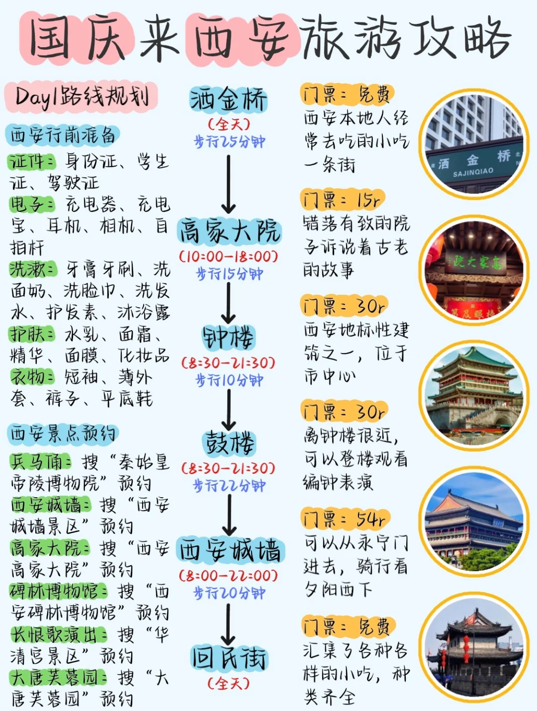
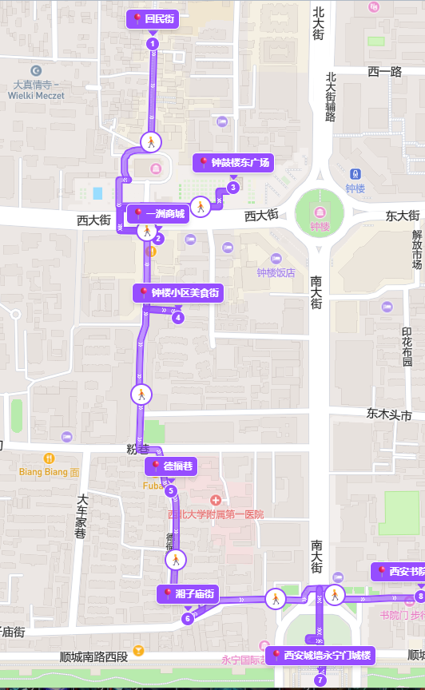
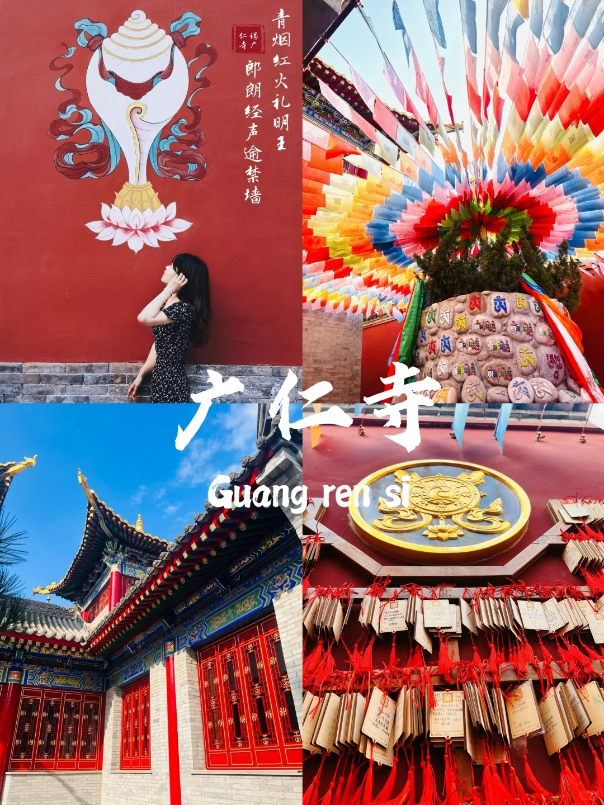
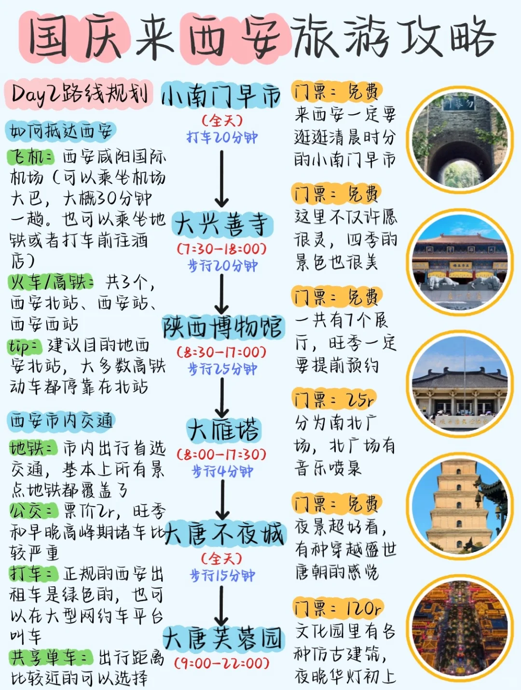
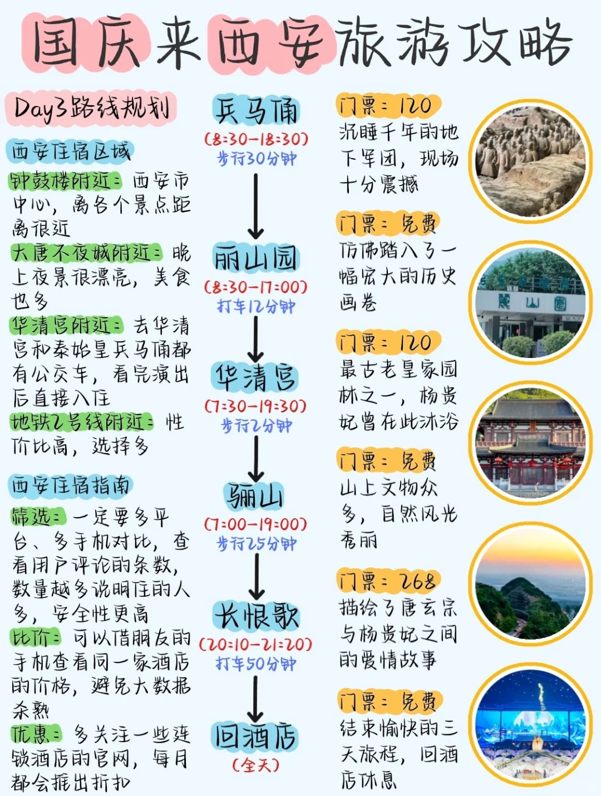

# 西安

西安是一个四季分明的城市，在9-11月份期间步入深秋，树叶都染上金黄色。

## 交通

机场：咸阳机场

票价记录（往返9月30日-10月4日）

| 日期    | 平台                               | 航空公司 | 价格    |
| :------ | :--------------------------------- | :------- | :------ |
| 9月20日 | [携程旅行](https://www.ctrip.com/) | 海南航空 | 1090 元 |
| 9月22日 | [美团]()                           | xx航空   | 1440 元 |
| 9月23日 | [携程旅行]()                       | xx航空   | 1400 元 |
| 9月24日 | [美团]()                           | 海南航空 | 1390 元 |

## 行李

- **证件**
    - [ ] 身份证 * 2
    - [ ] 机票 * 2

- **交通卡**
    - [ ] 西安地铁

- **洗浴**
    - [ ] 一次性毛巾
    - [ ] 一次性四件套

- **衣物（气温较低）**
    - [ ] 外套

- **电子产品**
    - [ ] MacBook Air
    - [ ] Ipad
    - [ ] 充电宝 * 1

    

## 门票

=== "门票购买"
    1. 一定要用美团！！（小程序也是跳转美团，我用小程序3天都没抢到，美团一次成功）
    2. 首先在抢票之前在美团app中提前找一个免费的博物馆提前填好身份信息（很重要）
    3. 每天10，11，18，19整点放票，提前三天预约，比如1号能预约3号的
    4. 以上午10点为例，一定要提前3~5分钟进入界面，就是，10点一到千万不要着急点或者返回重新进，等到01分来回切日期查看余票，当看到显示余票后，再速度点你需要选择的日期和时间段，接着选中几张和预约人员信息，选中后不要提交！停留到此页面不要动！！如图2（因为直
    接提交大概率抢不到或者直接卡退出去）
    5. 保留美团此页面不要退出！！保留美团此页面不要退出！！保留美团此页面不要退出！！重要的话说三遍，不要后台，一小时后，11点01（注意不要准点抢，一定要11:00:30后）提交预约人员信息，丝滑到手

## 妆造

穿汉服、打扮妆容

???+ question "细节"

    1. 妆造一定要问，都有哪些套餐和优惠（因为你自己讲的可能都在人家套餐里，可能套餐更便宜)，问完了之后再选择，都有哪些衣服，可以随便试么，都可以试么？（有些家不是每个衣服都包括在内)   

    2. 试之前要问这些衣服要注意什么么？都哪里容易坏，一定要认真检查，（有的不注意坏了，是要赔偿的)  

    3. 化妆也很重要的，你一定要表达清楚想要什么样的，也要问清楚价格，因为有化妆单算的   

    4. 关于修底片，其实，很多好的创意和技术，真的不需要精修，一般店都会把底片给你的，但是也有超过多少另收钱的   

    5. 真的不是越贵越好，很多10元5张的，比300，2张的都好！7天胖了10斤，6个博物馆，6个演出，7个寺庙，我做了43页攻略为了这7天

## 五天四晚

### DAY1 钟鼓楼

=== "回民街-一洲商城-钟鼓楼-钟楼小区-湘子庙街"

    !!! quote "图片"
    
        === "概览"
                 
        === "路线"
            

-   :material-clock-fast:{ .lg .middle } __介绍__

    ---

    ---

    **回民街**

    🥪早市
    
    
    **一洲商城**
    
    💕妆造：200元以内就有很不错的造型，推荐的店铺（）

    

    **钟鼓楼（15：00-18:00）**

    🚴‍♂️路线：鼓楼➡开元商场➡钟楼

    早上9:30、10:15、11:00、11:45都有编钟表演
    晚上有灯光
    不建议登钟楼，可以在对面开元商场5、6/楼露天观景台上合影拍照
    可以登鼓楼？    

    **钟楼小区**

    💕特色：本地人推荐的美食街；午市    
    
    
        

    **西安城墙（14：30-16：30）**
    
    ⌚步行时间：约20分钟

    🚴‍♂️路线：含光门➡勿幕门➡朱雀门➡永宁门

    💕特色：9:00迎宾开城仪式、其他时间段有表演节目
            
    城墙上挺晒的，非必要可以不上去；
    开城门仪式很震撼，考虑买开城门仪式表演的票看表演   

    

    

    更推荐去大皮院等   
    
    **高家大院（）**

    💕特色：皮影戏（10分钟）、华阴老腔
    
    现场购买门票，在大宅院里面演出节目，据说排队的人很多地方很小很挤

    
        
    洒金桥

    ⌚开放时间：6：30-10：30
    
    💕特色：小吃街
    
    评价说较为脏乱差，整体不如回民街
    
    
    ??? tip inline end "图片"

        <figure markdown="span">
        { width="300" }
        <figcaption>红墙，很出片</figcaption>
        </figure>

    **广仁寺（9:00-11：30）**
    

    

---
**预算**

门票：(54 + 30 + 30 ) * 2 = 216 元

### DAY2 大唐不夜城

=== "小南门早市-大兴善寺-陕西/考古博物馆-大雁塔-大唐不夜城-大唐芙蓉园-老版火锅（玉祥门店）"
    ??? quote "图片"
        

-   :material-clock-fast:{ .lg .middle } __介绍__

    ---

    ---

    历史博物馆、考古博物馆的值得去  
    大雁塔广场上有音乐喷泉表演，也是8点结束 
    大唐不夜城可以租汉服拍照打卡，要货比多家；早一点去晚上八点以后就没有表演了，个人觉得不看表演只是逛的话有点单调。    
    

预算（120 + 25） * 2 = 290 元

### DAY3 兵马俑&长恨歌

=== "兵马俑-丽山园-华清宫-骊山-长恨歌"
    ??? quote "图片"
        

-   :material-clock-fast:{ .lg .middle } __介绍__

    ---

    ---

    兵马俑下午4点闭关，优先去1号坑，一定要有讲解！！    
    丽山园的官方导游很便宜，10块钱一个人很值，还有一定要坐园区的车，不然真的费腿；  
    长恨歌提前订票，演出很好    

预算（120 + 120 +268） * 2 = 508 元

### DAY4 

=== "考古博物馆-香积寺-广仁寺-石炉火锅-古观音禅寺"

-   :material-clock-fast:{ .lg .middle } __介绍__
    广仁寺外面的红墙配合秋景很适合出片、进去可以免费请3柱香     

### DAY5 

=== "壶口瀑布-永兴坊"

1. 购买伴手礼或特产？
2. 

-   :material-clock-fast:{ .lg .middle } __介绍__

### 未竟

## 美食

1. 石炉火锅
2. 大皮院美食街
3. 肉夹馍
4. 牛羊肉泡馍
5. 油泼面
6. 宫廷牛肉饼
7. 凉皮
8. 胡辣汤
9. 

## 酒店

永宁门站附近，步行可去钟鼓楼、回民街、洒金桥、城墙，附近还有地铁

小寨附近临近大雁塔广场、赛格购物中心、大悦城、陕西博物馆、大唐不夜城

 189

| 日期    | 平台 | 酒店     | 价格    | 规格       |
| :------ | :--- | :------- | :------ | :--------- |
| 10月1日 | 美团 | 海友酒店 | 500+ 元 | 双人大床房 |

## 特产

- **小吃**

    📍选购场所：钟楼小区、瑞丰食品城
    
    🛒清单：
        1. 锅巴
        2. 

- **伴手礼**

    📍选购场所：
    
    🛒清单：
        1. 兵马俑
        2. 肉夹馍

