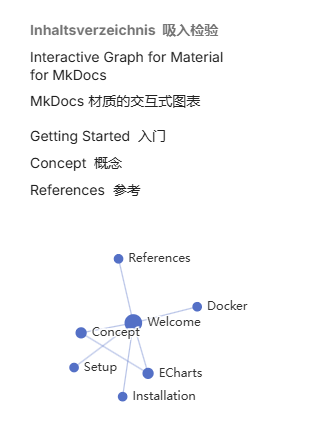
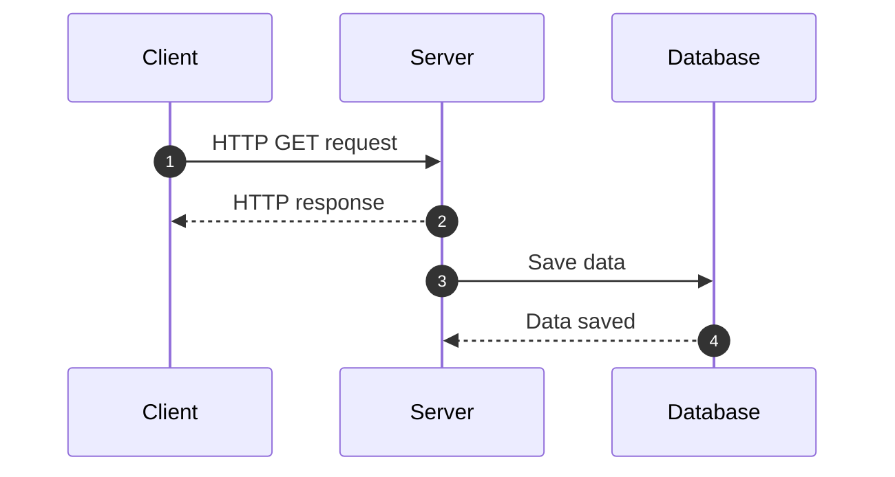

# [Markdown extensions syntax](https://squidfunk.github.io/mkdocs-material/reference/buttons/)

<div class="grid cards" markdown>

- [pymdown-extensions](https://facelessuser.github.io/pymdown-extensions/)

    PyMdown Extensions 是 Python Markdown 扩展的集合。
    它包含Install and Usage

- [Interactive Graph](https://daxcore.github.io/mkdocs-obsidian-interactive-graph-plugin/)

    MkDocs 的材质交互式图表（例如 Obsidian）
  
    

        pip install mkdocs-obsidian-interactive-graph-plugin
    
        plugins:
          - obsidian-interactive-graph
- [图片选择器]()

    markdown或html语法生成选择器，点击选择器打开directory选择图片，支持各个类型。支持拖动
    
- [天气系统]()
    
</div>

---

## 1.1 Content tabs

```
=== "name A"
    ```
    content
    ```
=== "name B"
    ```
    content
    ```
```

=== "name A"
    ```
    content A
    ```
=== "name B"
    ```
    content B
    ```

## 1.2 Instant previews

``` markdown
[Attribute Lists](#){ data-preview }
```

[Extensions](#){ data-preview }

```
markdown_extensions:
  - attr_list
```

## 1.3 Sequence diagram

    ``` mermaid
    sequenceDiagram
      autonumber
      Client->>Server: HTTP GET request
      Server-->>Client: HTTP response
      Server->>Database: Save data
      Database-->>Server: Data saved
    ```




## 1.4 Blog

some extension plugins

### 1.4.1 Excerpt

At the end of the article,use `<!-- more -->` that will only display the content before `<!-- more -->`

```
# Hello world!

Lorem ipsum dolor sit amet, consectetur adipiscing elit. Nulla et euismod
nulla. Curabitur feugiat, tortor non consequat finibus, justo purus auctor
massa, nec semper lorem quam in massa.

<!-- more -->
...
```

###  1.4.2 Categories

Group posts into groups


## 1.5 特殊符号

依赖模块: pymdownx.smartsymbols

| 符号          | 效果        |
| :------------ | :---------- |
| `(tm)`        | (tm)        |
| `(c)`         | (c)         |
| `(r)`         | (r)         |
| `c/o`         | c/o         |
| `+/-`         | +/-         |
| `-->`         | -->         |
| `<--`         | <--         |
| `<-->`        | <-->        |
| `=/=`         | =/=         |
| `1/4 3/5`     | 1/4 3/5     |
| `1st 2nd 3rd` | 1st 2nd 3rd |